# hse_hw2_chip

Колаб: 
https://colab.research.google.com/drive/17GpRv62oer1UHD_D-PjlRrGWwsjsrvKP?usp=sharing

Выбрал клеточную линию DND-41, гистоновую клетку H4K20me1.

Чтения достаточно качественные, в целом можно было и не подрезать, но всё-таки решил сверить - дропнулись до 5%. 

#### Первая реплика - ENCFF000ARF, до и после подрезания:
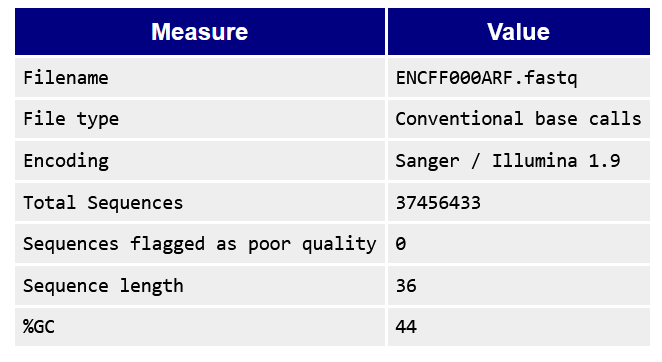 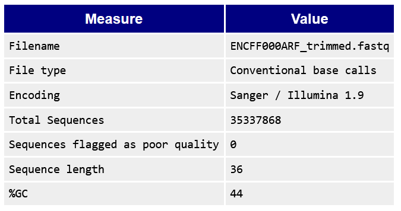

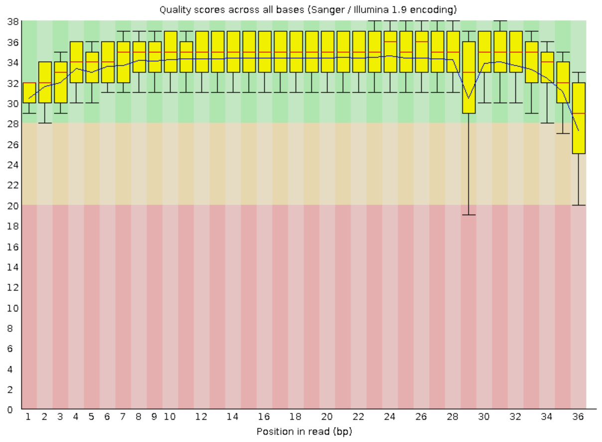 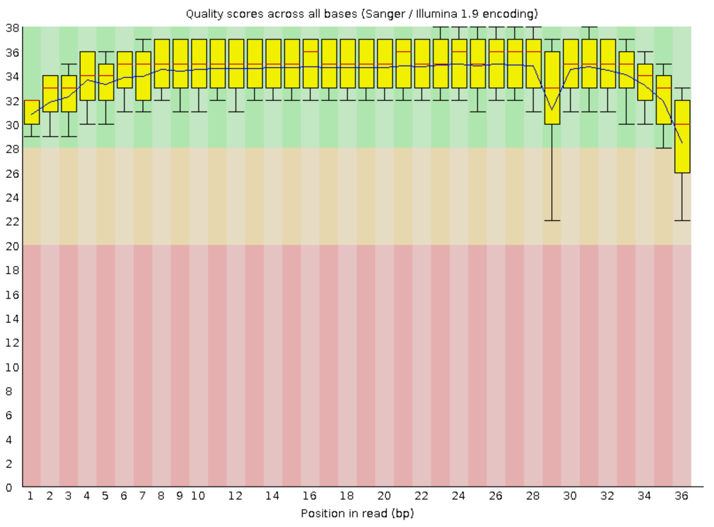

#### Вторая реплика - ENCFF000ARE, до и после подрезания:
 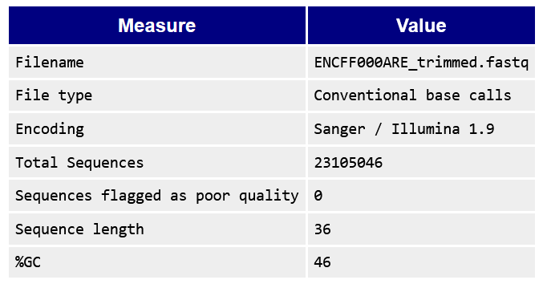

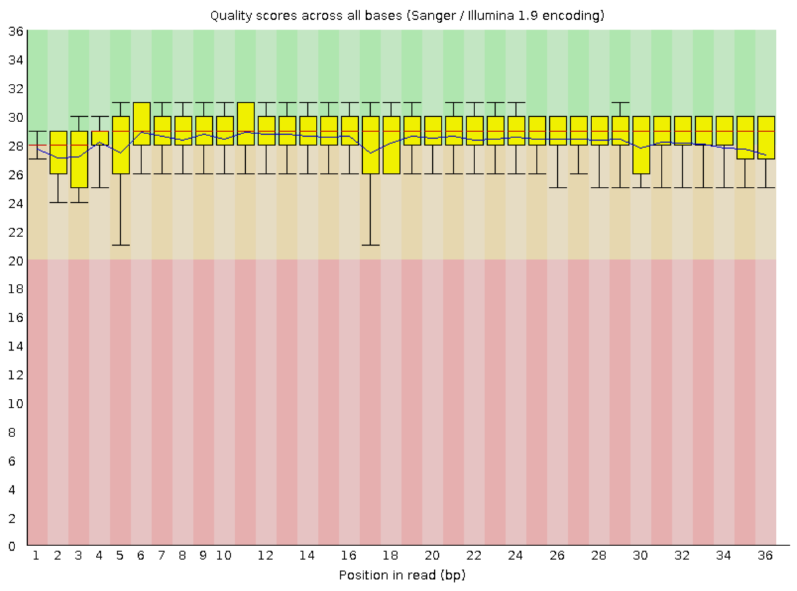 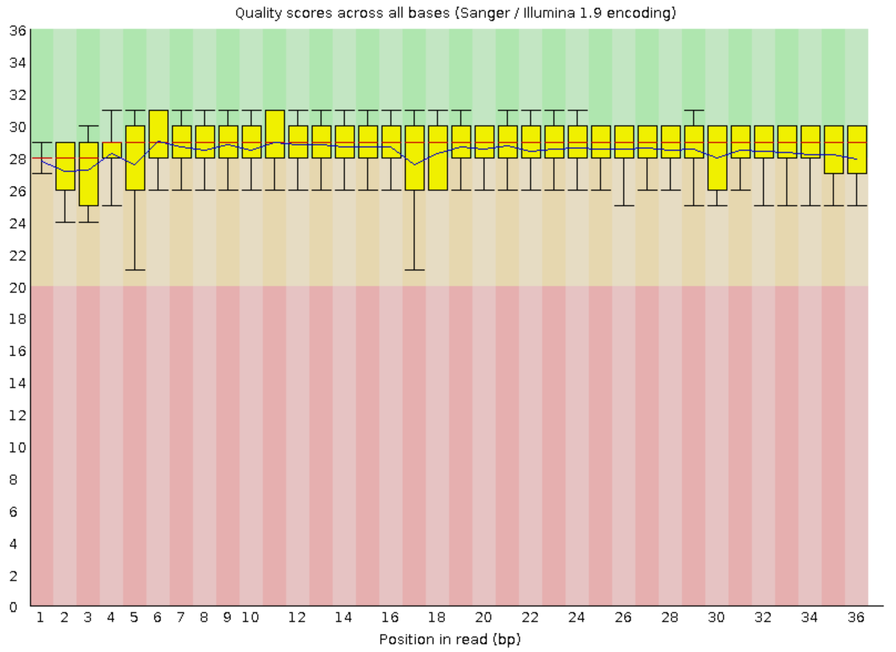

#### Контроль - ENCFF000AOF, до и после подрезания:
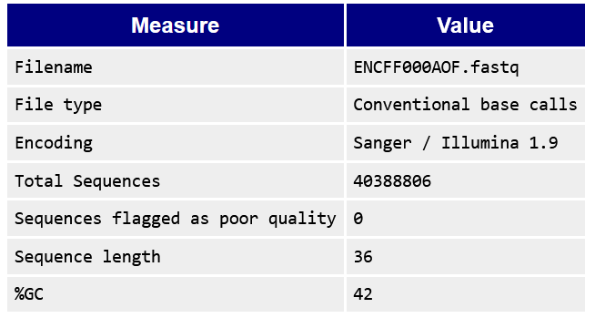 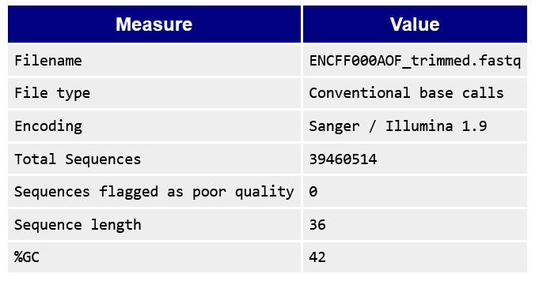

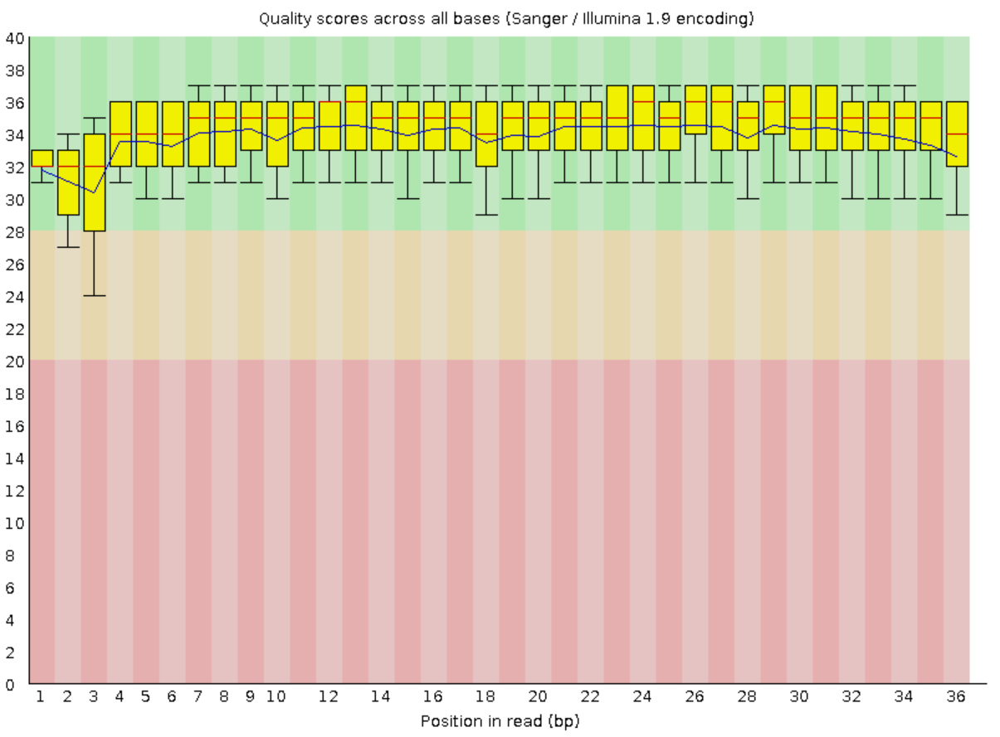 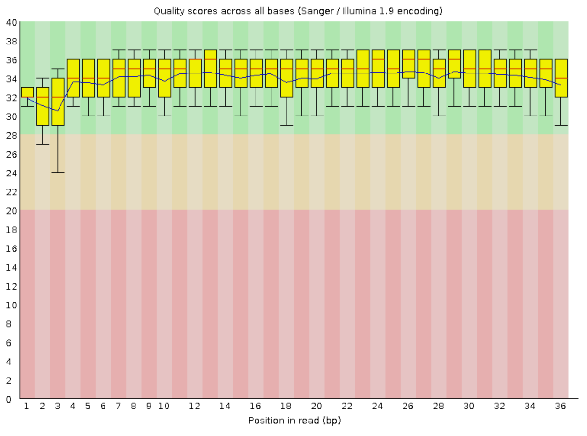

### Статистика по выравниванию на 21-ю хромосому:
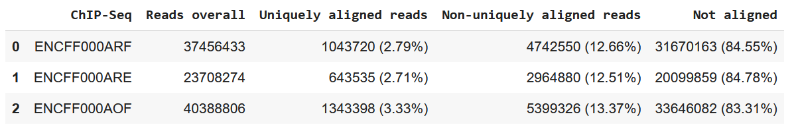

Процент выравниваний низкий, так как выравнивались только на одну хромосому человека.

### Диаграммы Эйлера-Венна

Пересечения первой реплики и ENCODE:

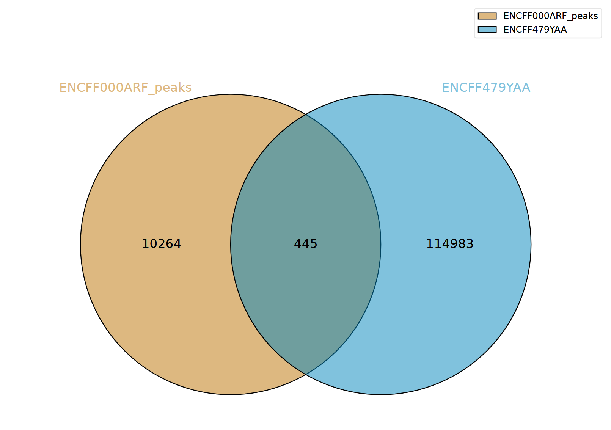 

Пересечение второй реплики и ENCODE:

 

Пересечений достаточно мало, так как, опять-таки, выравнивались на одну хромосому - в ENCODE составлялись пики для всех.

У файлов может быть разное количество участков, поэтому в зависимости от порядка пересечение будет меньше или больше.

Сорри, что все файлы в корень репозитория, нет времени загружать с компа, на сайте не нашёл :(
